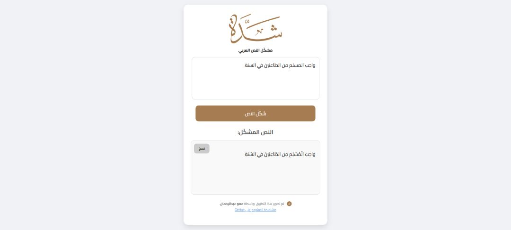

# Shaddah - Arabic Text Diacritizer



Shaddah is a simple web app for automatically adding diacritics (tashkeel) to Arabic text. The app uses **mishkal.py** as the base model for processing and diacritizing Arabic text, allowing you to get properly diacritized text quickly and easily.

> ⚠️ Note: The accuracy is not perfect, but it works well most of the time.

---

## Features

- Enter Arabic text and get the diacritized version with a single click.
- Copy the diacritized text directly with a "Copy" button.
- Simple, clean interface with right-to-left (RTL) support for Arabic.
- Can be used **independently** or as part of the **Mawj extension ecosystem**.

---

## Installation & Running the App

1. **Clone the repository**:

```bash
git clone https://github.com/neon-x-hub/shaddah.git
cd shaddah
```

2. **Install dependencies**:

```bash
pip install -r requirements.txt
```

3. **Run the app**:

```bash
python app.py
```

4. **Open your browser** and go to:

```
http://localhost:54166
```

Your app should now be running locally and ready to use.

---

## How to Use

1. Type or paste Arabic text into the input box.
2. Click the "Diacritize" button.
3. The diacritized text will appear below, and you can copy it using the "Copy" button.

---

## Requirements

- Modern web browser supporting HTML5, CSS3, and JavaScript.
- Internet connection (required to load Google Fonts - Cairo).
- Installed version of python and required deps.
---

## Notes

- Lightweight and easy to use for daily diacritization tasks or integration into larger projects.
- Accuracy depends on the mishkal.py model, so minor manual adjustments may sometimes be necessary.

---

## Using as a Mawj Extension

If you are using Shaddah as part of the **Mawj extension ecosystem**, you don’t need to run it manually.
Simply configure the **IP address** and **port** in the Mawj settings menu, and the extension will connect to the app automatically.

---

### Credits & Attributions

- Uses [**mishkal.py**](https://github.com/linuxscout/mishkal) for Arabic text diacritization as a base model.
- This app was developed by **Memmou Abderrahmane** as part of the **Mawj** extension ecosystem, but it works completely independently as well.
